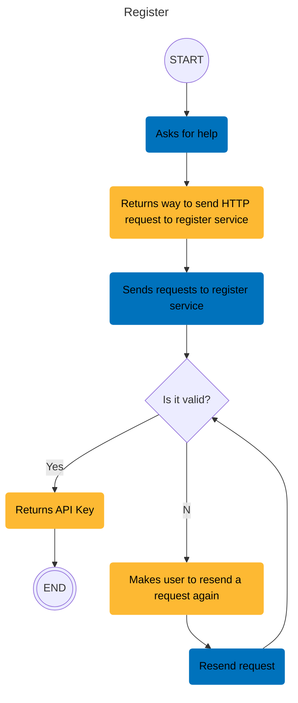
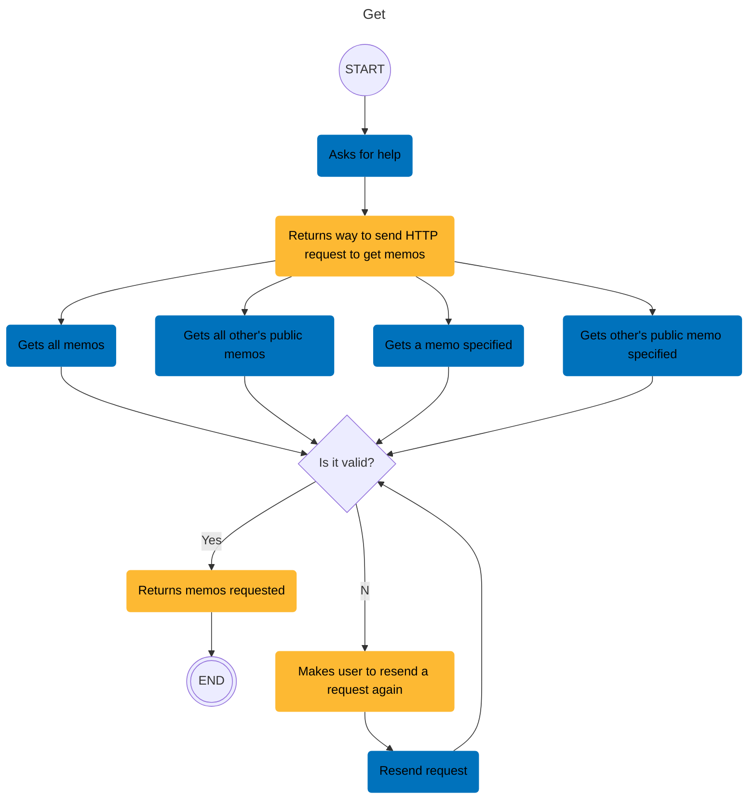

# Activity

```mermaid
---
title: Register
---
flowchart TD

  %% Define classes for style
  classDef user fill:#0072BC,stroke:none,color:black
  classDef server fill:#FDB933,stroke:none,color:black

  %% Diagram
  A((START)) --> B(Asks for help):::user
  B --> C(Returns way to send HTTP request to register service):::server
  C --> D(Sends requests to register service):::user
  D --> E{Is it valid?}
  E --Yes--> F(Returns API Key):::server
  F --> G(((END)))
  E --No--> H(Makes user to resend a request again):::server
  H --> I(Resend request):::user
  I --> E
```

```mermaid
---
title: Get
---
flowchart TD

  %% Define classes for style
  classDef user fill:#0072BC,stroke:none,color:black
  classDef server fill:#FDB933,stroke:none,color:black
  classDef point fill:black,stroke:none,color:black

  %% Diagram
  A((START)) --> B(Asks for help):::user
  B --> C(Returns way to send HTTP request to get memos):::server
  C --> D(Gets all memos):::user
  C --> E(Gets all other's public memos):::user
  C --> F(Gets a memo specified):::user
  C --> G(Gets other's public memo specified):::user
  D --> H{Is it valid?}
  E --> H
  F --> H
  G --> H
  H --Yes--> I(Returns memos requested):::server
  I --> J(((END)))
  H --No--> K(Makes user to resend a request again):::server
  K --> L(Resend request):::user
  L --> H
```