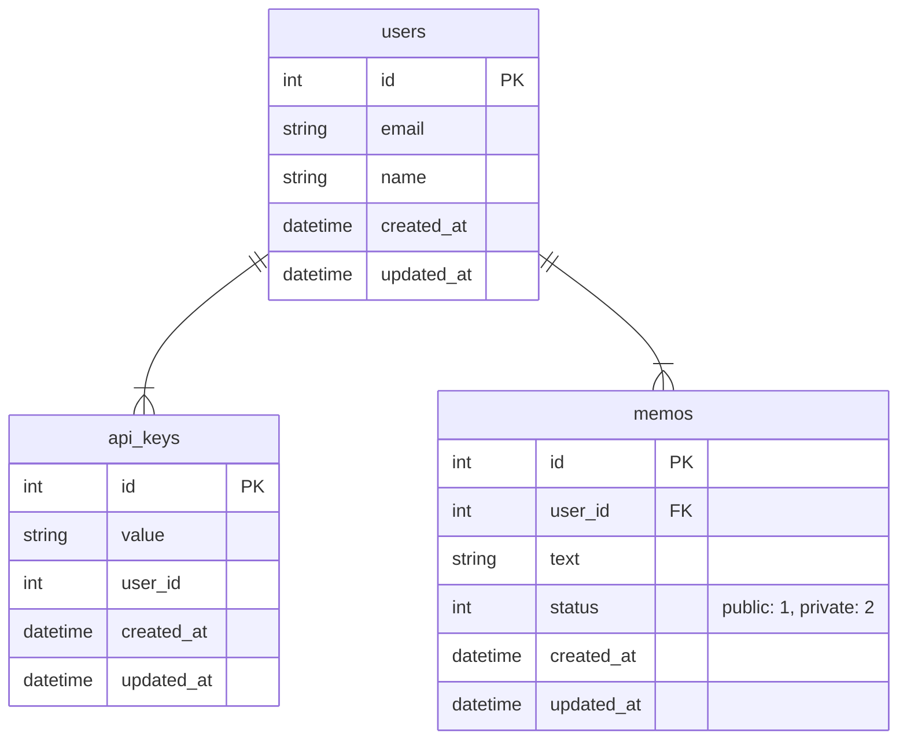

# ER

```mermaid
  erDiagram
  users ||--|{ api_keys : ""
  users ||--|{ memos : ""

  users {
    int id PK
    string email
    string name
    datetime created_at
    datetime updated_at
  }

  memos {
    int id PK
    int user_id FK
    string text
    int status "public: 1, private: 2"
    datetime created_at
    datetime updated_at
  }

  %% api_keys: Separate tables in case you need to reissue apikey
  api_keys {
    int id PK
    string value
    int user_id
    datetime created_at
    datetime updated_at
  }
```