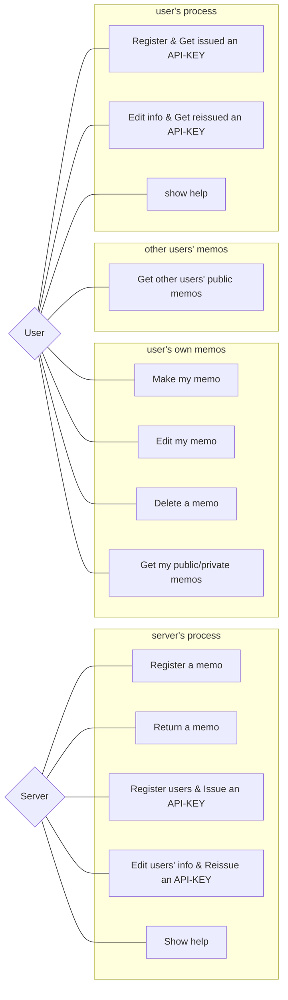

# Usecase

```mermaid
flowchart LR

A{User}
B{Server}

A --- C[Make my memo]
A --- D[Edit my memo]
A --- E[Delete a memo]
A --- F[Get my public/private memos]
A --- G[Get other users' public memos]
A --- H[Register & Get issued an API-KEY]
A --- I[Edit info & Get reissued an API-KEY]
A --- J[show help]

B --- Z[Register a memo]
B --- Y[Return a memo]
B --- X[Register users & Issue an API-KEY]
B --- W[Edit users' info & Reissue an API-KEY]
B --- V[Show help]


subgraph server's process
  Z
  Y
  X
  W
  V
end

subgraph user's own memos
  C
  D
  E
  F
end

subgraph other users' memos
  G
end

subgraph user's process
  H
  I
  J
end
```